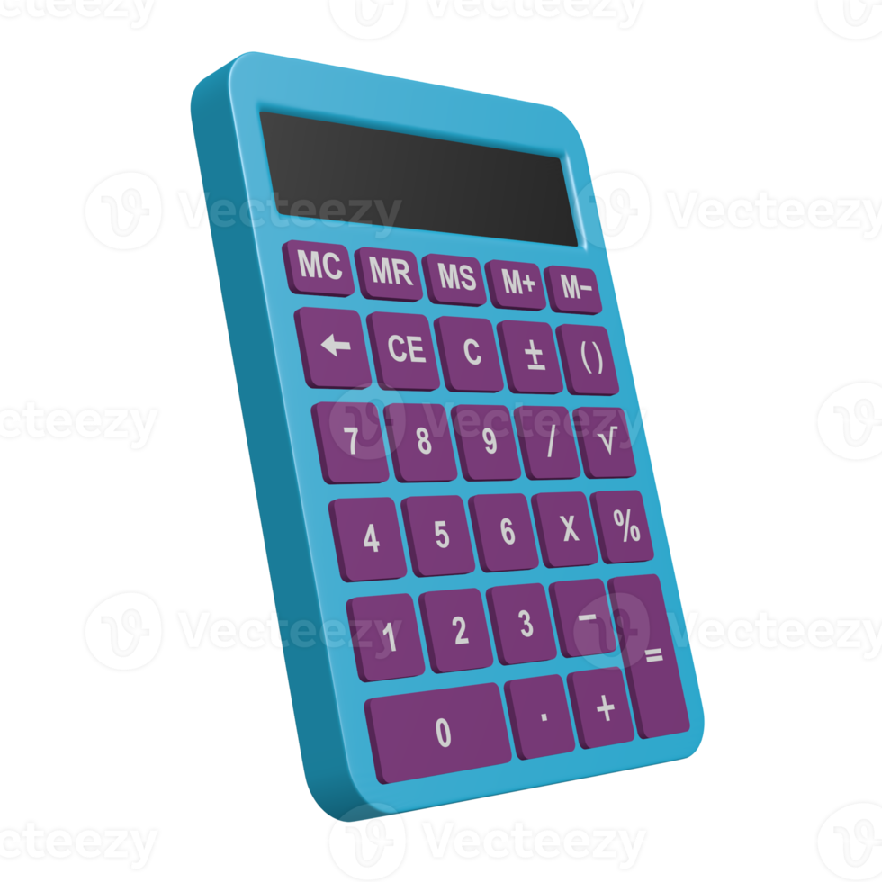

# Calculadora básica.
Versión: 1.0
Autor: Alberto Vicente Fernández.
Licencia: ""None""


## Índice
1. [Descripción del proyecto](#descripción-del-proyecto)
2. [Objetivos](#objetivo) 
3. [Tecnologías utilizadas](#instrucciones-de-uso)
4. [Arquitectura del proyecto](#solución-de-problemas)
5. [Funcionalidades](#información-de-contacto)
6. [Instrucciones de instalación y uso](#información-de-contacto)
7. [Solución de problemas comunes](#reconocimientos)


## Descripción del proyecto
Esta app sirve para realizar operaciones básicas como una calculadora.

[documentacion](https://docs.google.com/document/d/1ViiyzYsbwUaWqanK7lnnvs3tJgUnyQml/edit#heading=h.eh3vlx9gp4wm)

## objetivo
Aprobar el exámen para ello el programa  hacer:
 - sumar
 - restar
 - dividir
 - multiplicar

### Tecnologías utilizadas

| tecnologias  | dificultad |
| ------------- | ------------- |
| HTML5  | 6  |
| Hoja de cálculo (css)  | 6  |
| JavaScrript  | 7  |
## Arquitectura delproyecto
JavaScript: funcion calcular es la encargada de realizar las operaciones
```js
function calcular() {
    ...
}
```
Css:realiza el estilo de la pagina
```css
body {
    font-family: sans-serif;
}
```


## Funcionalidades
 - sumar
 - restar
 - dividir
 - multiplicar


## Instrucciones de instalación y uso
Información básica: Cómo usar la calculadora básicas del proyecto o software.
Ejemplos: Ejemplos de cómo usar el proyecto o software para realizar tareas comunes.
Casos de uso: Casos de uso más avanzados del proyecto o software.

## Solución de problemas comunes
Cómo contribuir al proyecto: Instrucciones sobre cómo contribuir al proyecto, como enviar informes de errores o solicitudes de funciones.
Directrices para la comunidad: Directrices para la participación en la comunidad del proyecto.


